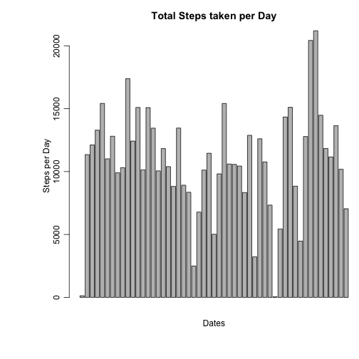
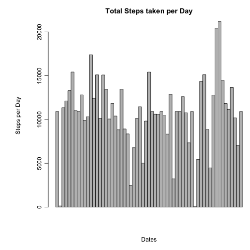
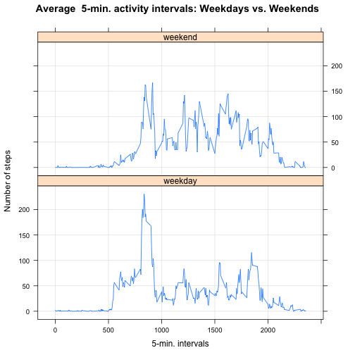

## Loading and preprocessing the data
1. Load the data (i.e. read.csv())

```r
# read dataset and load data in R
activity <- read.csv("./data/activity.csv")
```

2. Process/transform the data (if necessary) into a format suitable for your analysis

```r
# Besides observing NA values and they will be removed from caluculations
str(activity)
```

```
## 'data.frame':	17568 obs. of  3 variables:
##  $ steps   : int  NA NA NA NA NA NA NA NA NA NA ...
##  $ date    : Factor w/ 61 levels "2012-10-01","2012-10-02",..: 1 1 1 1 1 1 1 1 1 1 ...
##  $ interval: int  0 5 10 15 20 25 30 35 40 45 ...
```

```r
## While it might have been prudent to remove the data that was completely missing
#ie data from the "2012-10-01" as they were all NA
stepsOn20121001 <- activity$steps[activity$date=="2012-10-01"]
str(stepsOn20121001)
```

```
##  int [1:288] NA NA NA NA NA NA NA NA NA NA ...
```

```r
## The data did not need any further processing at this time
```
## What is mean total number of steps taken per day?
1. Calculate the total number of steps taken per day

```r
# create a data frame containing the sum of steps for each date
totalStepsPerDay <- aggregate(steps ~ date, data=activity, FUN="sum")

# change "Group.1" "x" to meaningful names
colnames(totalStepsPerDay) <- c("Date", "Steps")

#show first five records
head(totalStepsPerDay)
```

```
##         Date Steps
## 1 2012-10-02   126
## 2 2012-10-03 11352
## 3 2012-10-04 12116
## 4 2012-10-05 13294
## 5 2012-10-06 15420
## 6 2012-10-07 11015
```

2. Make a histogram of the total number of steps taken each day


```r
with(totalStepsPerDay, {
    par(mar=c(5.75,6.75,3,0), mgp=c(1.75,0.75,0))
    barplot(
      height=Steps,
      main="Total Steps taken per Day",
      xlab="Dates",
      ylab="Steps per Day"
    )
})
```

 

3. Calculate and report the mean and median of the total number of steps taken per day


```r
mean(totalStepsPerDay$Steps, na.rm=TRUE)
```

```
## [1] 10766.19
```

```r
median(totalStepsPerDay$Steps, na.rm=TRUE)
```

```
## [1] 10765
```

## What is the average daily activity pattern?
1.  Make a time series plot (i.e. type = "l") of the 5-minute interval (x-axis) and the average number of steps taken, averaged across all days (y-axis)


```r
intervalOfAvgStepsPerDay <- aggregate(steps~interval,data=activity,FUN=mean,na.action=na.omit)
colnames(intervalOfAvgStepsPerDay) <- c("interval", "avgStepsPerDay")

with(intervalOfAvgStepsPerDay, {
    plot(
      x=interval,
      y=avgStepsPerDay,
      type="l",
      main="Average Steps against Interval Time-Series",
      xlab="5-minute Interval",
      ylab="Average Steps Per Day"
    )
})
```

 

2. Which 5-minute interval, on average across all the days in the dataset, contains the maximum number of steps?

```r
intervalOfAvgStepsPerDay$interval[which.max(intervalOfAvgStepsPerDay$avgStepsPerDay)]
```

```
## [1] 835
```

## Imputing missing values
Note that there are a number of days/intervals where there are missing values (coded as NA). The presence of missing days may introduce bias into some calculations or summaries of the data.

1. Calculate and report the total number of missing values in the dataset (i.e. the total number of rows with NAs)


```r
# total missing data in activity
length(which(is.na(activity)))
```

```
## [1] 2304
```

```r
# missing data by column: steps date interval
sum(is.na(activity$steps)); sum(is.na(activity$date)); sum(is.na(activity$interval))
```

```
## [1] 2304
```

```
## [1] 0
```

```
## [1] 0
```
2. Devise a strategy for filling in all of the missing values in the dataset. The strategy does not need to be sophisticated. For example, you could use the mean/median for that day, or the mean for that 5-minute interval, etc.


```r
# using averaged steps per interval (over all days) to replace the missing value for a given day/interval.
# decimal values will be rounded up to a whole number
intervalOfAvgStepsPerDay$avgStepsPerDay<-ceiling(intervalOfAvgStepsPerDay$avgStepsPerDay)
```
3. Create a new dataset that is equal to the original dataset but with the missing data filled in.


```r
#coping original activity data frame to NA Free data frame
naFreeActivity <- activity

# loop through each row in naFreeActivity
# check if the "steps" value is missing, if so, replace the missing value with the mean for that interval
for (i in 1:nrow(naFreeActivity)) {

    if(is.na(naFreeActivity$steps[i])) {

        naFreeActivity$steps[i] <- intervalOfAvgStepsPerDay$avgStepsPerDay[which(intervalOfAvgStepsPerDay$interval==activity$interval[i])]
    }
}

# validate total missing data in activity = 0 
length(which(is.na(naFreeActivity)))
```

```
## [1] 0
```

```r
#Comparision of the original activity data set for steps against the newly imputed data set 
#with NA values replaced with the average nbr of steps per interval
str(activity$steps)
```

```
##  int [1:17568] NA NA NA NA NA NA NA NA NA NA ...
```

```r
str(naFreeActivity$steps)
```

```
##  num [1:17568] 2 1 1 1 1 3 1 1 0 2 ...
```
4. Make a histogram of the total number of steps taken each day and Calculate and report the mean and median total number of steps taken per day. Do these values differ from the estimates from the first part of the assignment? What is the impact of imputing missing data on the estimates of the total daily number of steps?

- histogram of the total number of steps taken each day


```r
totalNAFreeStepsPerDay <- aggregate(naFreeActivity$steps, list(naFreeActivity$date), sum)
# change "Group.1" "x" to meaningful names
colnames(totalNAFreeStepsPerDay) <- c("Date", "Steps")

with(totalNAFreeStepsPerDay, {
    par(mar=c(5.75,6.75,3,0), mgp=c(3.75,0.75,0))
    barplot(
      height=Steps,
      main="Total Steps taken per Day",
      xlab="Dates",
      ylab="Steps per Day",
      space=c(0)
    )
})
```

 

- mean and median total number of steps taken per day


```r
mean(totalNAFreeStepsPerDay$Steps)
```

```
## [1] 10784.92
```

```r
median(totalNAFreeStepsPerDay$Steps)
```

```
## [1] 10909
```

- do these values differ from the estimates from the first part of the assignment? What is the impact of imputing missing data on the estimates of the total daily number of steps?


```r
#Comparision of the two data frames ( summary of the total steps per day of activity and summary of
#activity imputed data for NA values were applied, ) there appears to be 8 more observations in the new #totalNAFreeStepsPerDay data frame. 
# it appears that in the originial activity data set, there were days with no observations ie "2012-10-01"
str(totalStepsPerDay)
```

```
## 'data.frame':	53 obs. of  2 variables:
##  $ Date : Factor w/ 61 levels "2012-10-01","2012-10-02",..: 2 3 4 5 6 7 9 10 11 12 ...
##  $ Steps: int  126 11352 12116 13294 15420 11015 12811 9900 10304 17382 ...
```

```r
str(totalNAFreeStepsPerDay)
```

```
## 'data.frame':	61 obs. of  2 variables:
##  $ Date : Factor w/ 61 levels "2012-10-01","2012-10-02",..: 1 2 3 4 5 6 7 8 9 10 ...
##  $ Steps: num  10909 126 11352 12116 13294 ...
```

```r
# As a result this would give a higher mean/medium for those specific days, but for the days that were
# only missing a few intervals, there was a slight increase for those days
```

## Are there differences in activity patterns between weekdays and weekends?
1. Create a new factor variable in the dataset with two levels – “weekday” and “weekend” indicating whether a given date is a weekday or weekend day.


```r
# add new column 'day' and default it to a weekday
naFreeActivity$day <- "weekday"
# modify the new column 'day' to those days that fall on the weekend
naFreeActivity$day[weekdays(as.Date(naFreeActivity$date), abb=T) %in% c("Sat","Sun")] <- "weekend"
#print out the results of weekend versus weekday
table(naFreeActivity$day)
```

```
## 
## weekday weekend 
##   12960    4608
```

2. Make a panel plot containing a time series plot (i.e. type = "l") of the 5-minute interval (x-axis) and the average number of steps taken, averaged across all weekday days or weekend days (y-axis). See the README file in the GitHub repository to see an example of what this plot should look like using simulated data.

```r
intervalStepsByDay <- aggregate(data=naFreeActivity,steps ~ day + interval, FUN=mean)

xyplot(steps ~ interval | day, data=intervalStepsByDay, type="l", grid=T, layout=c(1,2), ylab="Number of steps", xlab="5-min. intervals", main="Average  5-min. activity intervals: Weekdays vs. Weekends")
```

 
